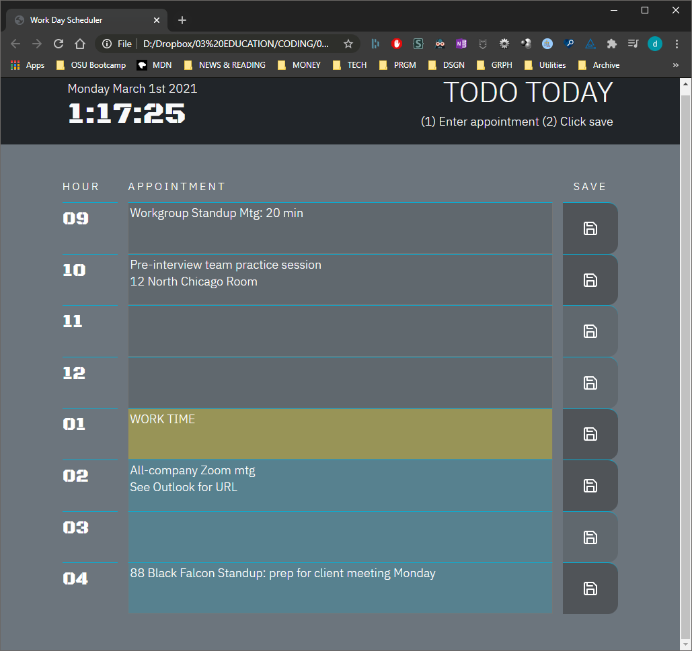

# Todo Today

[SEE THE DEPLOYED APPLICATION HERE](https://dishdesigner.github.io/day-planner/)

---

## Description

* This is a simple text-only daily business appointment app that records user inputs at each hour of the day between 9:00 am and 5:00 pm.
* When a user enters an appointment and clicks Save on that hour row, the entry is written to the local storage cache of the browser so that it can maintain state after browser refreshes.
* The save button tabs darken when that hour's appointment is saved in local storage.
* If a user deletes an appointment entry then clicks save, that entry is deleted from local storage and darkened save button state is removed.
* Darkened save button state is also restored after page refresh for any stored appointment entry.
* The calendar grid is also time-aware and changes its color scheme to indicate the current status of the day's appointments as either in the past, present, or future.
* The UI is stark and clean, monochrome with blue accents, and great care was taken to ensure that it is completely responsive to all devices and orientations!
* This app is built with HTML, CSS, pure Javascript, MomentJS, and the Bootstrap CSS framework for compatibility across all major browsers.

---

## Usage

The UI requires little orientation since features are so limited. 2-step instructions are included beneath the header title and say it all: (1) Enter appointments (2) Click save.

---

### Traditional 'stretch goals' for the app:
* Additional days: week and month views, requiring database expansion beyond simple browser local storage.
* Meetings that lapse over hour boundaries.
* Additional Views: change grid view to card view with drag-and-drop interface for re-ordering day's activities without having to re-enter text or copy/paste between grid zones.
* Timed reminders of upcoming events.
* Import / Export capabilities with Google & Outlook API Fetch calls.

### An alternative branding approach (better!):
* Do NOT create extensions above, but instead promote the simplicity of limiting the calendar to a "First Things First" organization tool that keeps you focused on The Right Now.
* Resist expansion into multi-day calendaring, which is already done better and more extensively elsewhere anyway (Google / Outlook).
* Dual View of Appointments Versus Tasks is key.
* Guide user to keep Tasks in Priority Order and complete them in order chosen, or at least track progress on uncomplete items.
* Tasks automatically reserve space in Priority Order on the day grid that are left undesignated (open work time). This keeps users on track all day long with a visual record of what matters most and helps to avoid sidetracking through multiple interruptions / meetings.
* Create a wearable watch version so the ONE THING you should be doing next is always a tap away on your wrist!

---

## License

See MIT License file within repo.

---